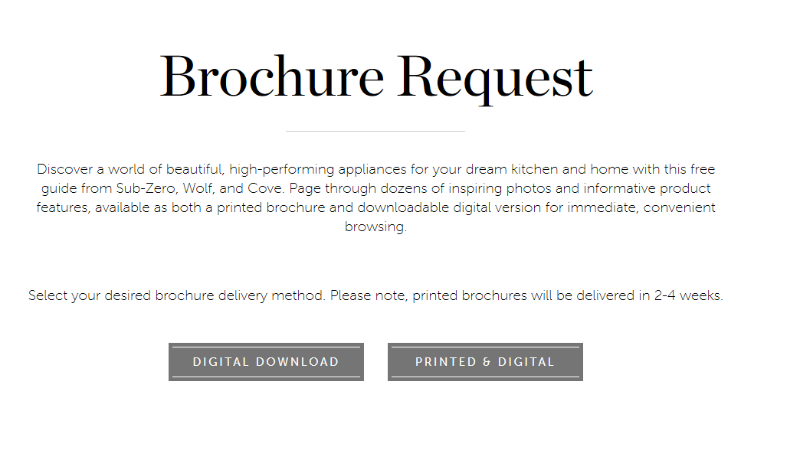

# szw-brochure-request

##Background
The key conversion point on the website is the brochure request form. Prospective shoppers can submit a brochure request form and receive an informational brochure with information about the products. Historically, the form has been offered in both a digital format and a printed format. The digital brochure is available immediately. The printed brochure takes between 2-4 weeks to arrive at the user's door. 

Recently, an analysis showed that submissions that utilized the digital brochure led to more revenue. As such, the client requested that we begin to phase out the printed brochure. 

The client wanted to ensure that removing the printed option did not negatively impact conversion rates before they implemented the change in their CMS, Sitecore. As such, we leveraged our A/B Testing tool, Adobe Target, to implement and test the impact of the change with agility. 

##How did the form operate before?

The form page gives the user the option as to which form they would like to receive. 
The form is not visible until the user selects what kind of form they would like. 
Once the user selects a form type, the respective form appears for the user to fill out. 
For the test, these two buttons should no longer appear. Furthermore, the digital form should display upon page load instead of on click of the button. 

The digital form is displayed below. This form should load on page load, instead of on click of the Digital Download button as before. 

The printed form is displayed below, This form is longer than is the digital form. It should not be displayed at all. 

Regardless of the type of form submission, the user is taken to the thank you page once they are done. This is what the page looks like before. For the test, on page load, the printed brochure should load between the View Digital Brochure button and the Create Account module. There should be some copy to lead the user into the form so as not to appear jarring. Furthermore, the copy above should change to reflect that the user can also submit a form to receive a printed brochure. This form is longer than the digital brochure, but has many overlapping fields. The user's input from the previous form should automatically fill out these overlapping fields once the form has loaded, and then hide those forms, so as not to encumber the user. Upon submission, the copy should change at the top to reflect the successful submission. The user should be scrolled to the top. 

